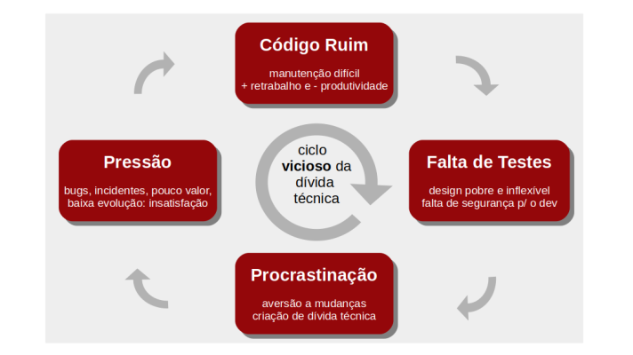
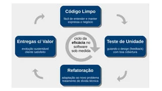

# Section 1 - Introdução

## Sintomas de Código Sujo

* Coreções de muitos Bugs
* Entregas cada vez menores
* Muito TO DO espalhado no código
* Dificuldade de evolução
* Reaparecimendo de erros
* Esforço maior que o previsto

## Ciclos de Código

### Ciclo de Código Sujo

    Código Ruim -> Falta de Teste -> Procastinação -> Pressão -> Código Ruim

### Ciclo de Código Limpo

    Código Limpo -> Teste de Unidade -> Refatoração -> Entrega do Valor -> Código Limpo

*Obs1.* O código limpo ajuda com mudanças

*Obs2.* Dá maior ciclo de vida ao projeto

*Obs3.* Ajuda pessoas a entender o código

## Filosofia

1. Pequenas coisas importam
2. Código é detalhamento dos requisitos e deve expressar o negócio
3. Código deve ser feito para ser lido por outra pessoa
4. Código ruim gera baixa produtividade que gera código pior
5. Atitude
6. Técnica, treino e tempo
